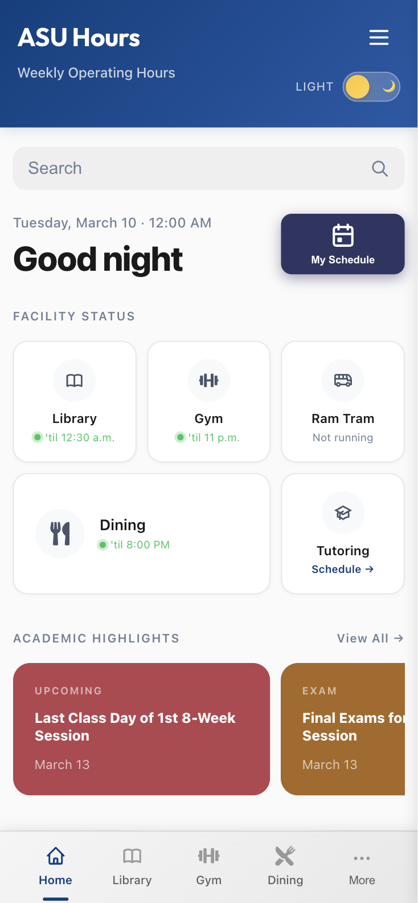
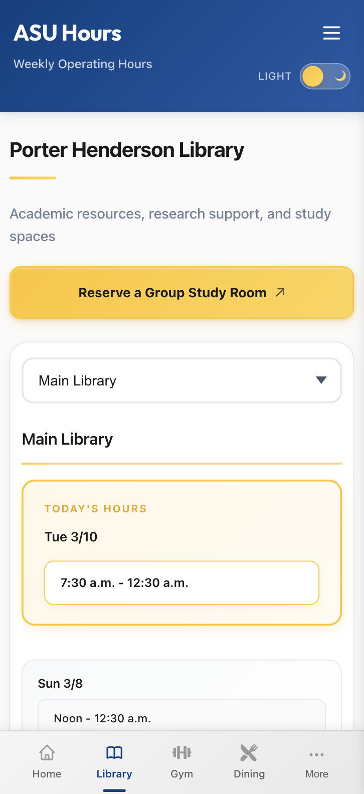
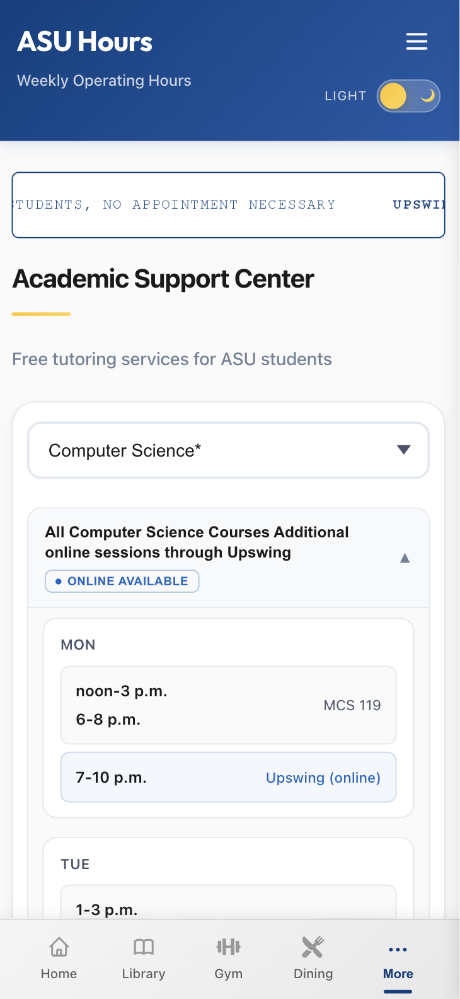
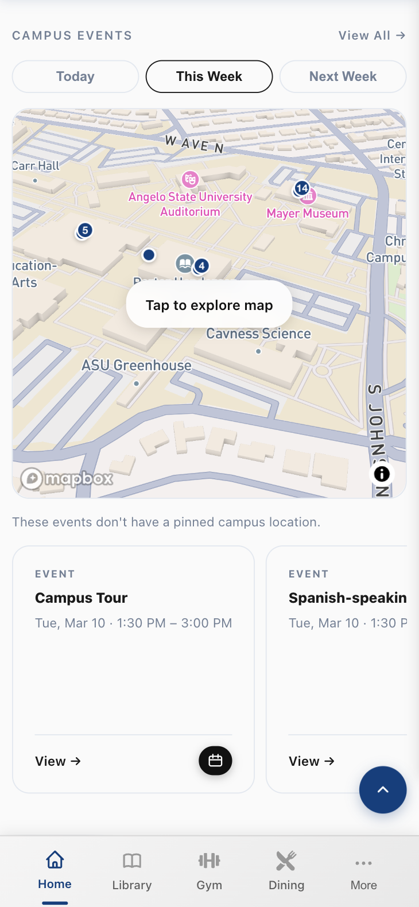

# ASU Facilities Hours of Operation

A full-stack web application providing real-time operating hours for Angelo State University (ASU) facilities — including the library, recreation center, dining venues, campus transportation, and tutoring services.

**Live Application**: [https://shinpark43.github.io/ASU-Facilities-Hours-of-Operation-Webpage/](https://shinpark43.github.io/ASU-Facilities-Hours-of-Operation-Webpage/)

---

## Screenshots

<div align="center">
  <table>
    <tr>
      <td align="center">
        
        <br/>
        <em>Home Dashboard</em>
      </td>
      <td align="center">
        
        <br/>
        <em>Porter Henderson Library</em>
      </td>
    </tr>
    <tr>
      <td align="center">
        
        <br/>
        <em>Academic Support Center</em>
      </td>
      <td align="center">
        
        <br/>
        <em>Campus Events Map</em>
      </td>
    </tr>
  </table>
</div>

---

## Features

- **Real-Time Hours** — Facility hours scraped daily from official ASU sources
- **Six Facilities** — Library, Recreation Center, Dining (4 venues), Ram Tram, and Tutoring
- **Academic Calendar** — Upcoming events pulled live from the ASU registrar page
- **Course Schedule Builder** — Interactive weekly grid for building a personal class schedule
- **Campus Event Map** — Mapbox-powered map showing campus event locations
- **Light / Dark Theme** — Toggle with localStorage persistence
- **PWA Support** — Installable as a home screen app on iOS and Android
- **Fallback Data** — Hardcoded mock hours served when the API is unavailable
- **Mobile-First** — Bottom tab bar, hamburger menu, auto-hiding header

---

## Tech Stack

| Layer | Technology |
|-------|-----------|
| Frontend | React 19, React Router v7, CSS custom properties |
| Backend | Node.js, Express 4 |
| Database | SQLite (WAL mode) |
| Scraping | Puppeteer (facility hours), Cheerio (calendar) |
| Map | Mapbox GL / react-map-gl |
| Cron | node-cron |
| Hosting | GitHub Pages (frontend), Railway (backend) |
| CI/CD | GitHub Actions |

---

## Architecture

```
┌─────────────────────────────┐
│   GitHub Pages (Frontend)   │
│   React SPA                 │
│   - Facility pages          │
│   - Schedule builder        │
│   - Event calendar map      │
└────────────┬────────────────┘
             │ REST API
┌────────────▼────────────────┐
│   Railway (Backend)         │
│   Node.js / Express         │
│   - In-memory cache (5 min) │
│   - Rate limiting           │
│   - Cron jobs               │
└────────────┬────────────────┘
             │
┌────────────▼────────────────┐
│   SQLite Databases          │
│   facilities.db             │  ← scraped daily at midnight CST
│   tutoring.db               │  ← scraped weekly on Sundays
└─────────────────────────────┘
```

**Data flow:**
1. Backend scrapes official ASU pages on startup (dev) and via cron jobs (production)
2. Hours are stored in SQLite and served through the REST API with a 5-minute cache
3. Frontend fetches from the API; falls back to hardcoded mock data if unavailable
4. Academic calendar events are scraped live with a 24-hour cache

---

## Project Structure

```
├── .github/
│   └── workflows/
│       └── deploy-frontend.yml     # GitHub Pages CI/CD
│
├── frontend/
│   ├── public/
│   │   ├── manifest.json           # PWA manifest
│   │   └── index.html
│   └── src/
│       ├── pages/
│       │   ├── Home.jsx            # Dashboard: facility grid, calendar, search
│       │   ├── Library.jsx         # Porter Henderson Library
│       │   ├── Gym.jsx             # CHP Recreation Center
│       │   ├── Dining.jsx          # CAF, Marketplace, TEA Co, Starbucks
│       │   ├── RamTram.jsx         # Campus bus (Gold/Blue routes)
│       │   ├── Tutoring.jsx        # Subject/course tutoring sessions
│       │   ├── Landing.jsx         # Marketing / onboarding
│       │   ├── HowToInstall.jsx    # PWA installation guide
│       │   └── About.jsx
│       ├── components/
│       │   ├── Layout.jsx          # Header, theme toggle, auto-hiding nav
│       │   ├── Sidebar.jsx         # Desktop navigation
│       │   ├── MobileTabBar.jsx    # Mobile bottom tab bar
│       │   ├── HamburgerMenu.jsx   # Mobile slide-out menu
│       │   ├── ScheduleWidget.jsx  # Interactive course schedule builder
│       │   ├── EventCalendarMap.jsx# Mapbox event map
│       │   ├── AnnouncementBanner.jsx
│       │   └── ScrollToTop.jsx
│       ├── services/
│       │   └── api.js              # API client + mock data fallback
│       └── utils/
│           └── timeUtils.js        # Time parsing and formatting helpers
│
├── backend/
│   ├── data/
│   │   ├── facilities.db           # SQLite: library, gym, dining, ram tram
│   │   └── tutoring.db             # SQLite: subjects, courses, sessions
│   ├── src/
│   │   ├── database.js             # Facilities DB init & queries
│   │   ├── tutoring-database.js    # Tutoring DB init & queries
│   │   ├── ScraperManager.js       # Puppeteer scraper (retry + backoff)
│   │   ├── scraper.js              # Thin scraper wrapper
│   │   ├── venueCoords.js          # Campus venue coordinates for map
│   │   └── routes/
│   │       ├── facilities.js       # /api/facilities
│   │       ├── tutoring.js         # /api/tutoring
│   │       ├── calendar.js         # /api/calendar
│   │       └── events.js           # /api/events
│   ├── scripts/
│   │   ├── init-db.js              # Database schema initialization
│   │   └── scraper.js              # Manual scraper runner
│   └── server.js                   # Express setup, cron jobs, graceful shutdown
│
├── images/
│   └── screenshots/
└── README.md
```

---

## API Endpoints

```
GET /api/health                         System health and DB status
GET /api/facilities                     All facilities metadata
GET /api/facilities/library             Porter Henderson Library hours
GET /api/facilities/recreation          Recreation Center / Pool hours
GET /api/facilities/dining              Dining venue hours
GET /api/facilities/ram_tram            Ram Tram schedule (time + route)
GET /api/tutoring                       All tutoring subjects, courses, sessions
GET /api/tutoring/subjects              Subject list
GET /api/tutoring/subjects/:id/courses  Courses for a subject
GET /api/tutoring/courses/:id/sessions  Sessions for a course
GET /api/tutoring/search?q=             Search tutoring
GET /api/calendar/upcoming              Next 5 academic calendar events
GET /api/events/upcoming                Upcoming campus events
```

### Sample facility response

```json
{
  "name": "Library",
  "type": "library",
  "sections": {
    "Main Library": {
      "Monday": "7:30 AM - 2:00 AM",
      "Tuesday": "7:30 AM - 2:00 AM",
      "Saturday": "10:00 AM - 8:00 PM",
      "Sunday": "12:00 PM - 2:00 AM"
    },
    "Research Assistance Desk": { "...": "..." }
  },
  "last_updated": "2025-01-15T00:00:00.000Z"
}
```

---

## Local Development

### Prerequisites
- Node.js 18+
- npm

### 1. Clone the repository

```bash
git clone https://github.com/shinpark43/ASU-Facilities-Hours-of-Operation-Webpage.git
cd ASU-Facilities-Hours-of-Operation-Webpage
```

### 2. Start the backend

```bash
cd backend
npm install
npm run init-db     # Create SQLite schema
npm run dev         # Start with nodemon (auto-reload)
```

The API server starts on `http://localhost:3001`. On first run in development mode, it automatically scrapes all facility data.

### 3. Start the frontend

```bash
# In a new terminal
cd frontend
npm install
npm start           # Opens http://localhost:3000
```

The frontend reads `REACT_APP_API_URL` (defaults to `http://localhost:3001`).

### Environment Variables

**Frontend** (create `frontend/.env.local`):
```
REACT_APP_API_URL=http://localhost:3001
REACT_APP_MAPBOX_TOKEN=<your_mapbox_token>
```

**Backend** (optional `.env`):
```
PORT=3001
NODE_ENV=development
DATABASE_PATH=./data/facilities.db
```

### Manual scraping

```bash
cd backend
npm run scrape      # Run all facility scrapers immediately
```

---

## Database Schema

### facilities.db

```sql
facilities        (id, name, type, description, website_url, ...)
facility_hours    (id, facility_id, section_name, day_of_week, open_time, close_time, is_closed, notes, ...)
scrape_log        (id, facility_type, status, message, scraped_at)
```

### tutoring.db

```sql
subjects          (id, name, display_order, ...)
courses           (id, subject_id, code, full_name, has_online, ...)
tutoring_sessions (id, course_id, day_of_week, time_range, location, is_online, is_tba, ...)
tutoring_scrape_log (id, status, subjects_count, courses_count, sessions_count, scraped_at)
```

---

## Deployment

### Frontend (GitHub Pages)

Deployed automatically via GitHub Actions on every push to `main` that changes files in `frontend/`. The workflow builds the React app and deploys to GitHub Pages using `REACT_APP_API_URL` and `REACT_APP_MAPBOX_TOKEN` from repository secrets.

### Backend (Railway)

Configured via `backend/railway.toml`. The build command runs `npm run init-db` and the app is started with `npm start`. A health check hits `/api/health`. Cron jobs in `server.js` handle daily and weekly scraping.

---

## PWA Installation

### iOS
1. Open the app in Safari
2. Tap the **Share** button (square with arrow)
3. Tap **Add to Home Screen**

### Android
1. Open the app in Chrome
2. Tap the **three-dot menu**
3. Tap **Add to Home Screen**

---

## License

MIT — see [LICENSE](LICENSE) for details.

---

*Made for ASU students, faculty, and staff.*
