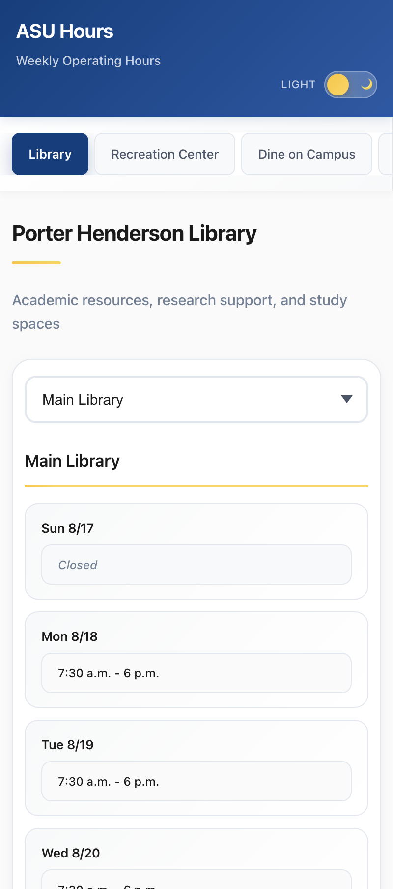
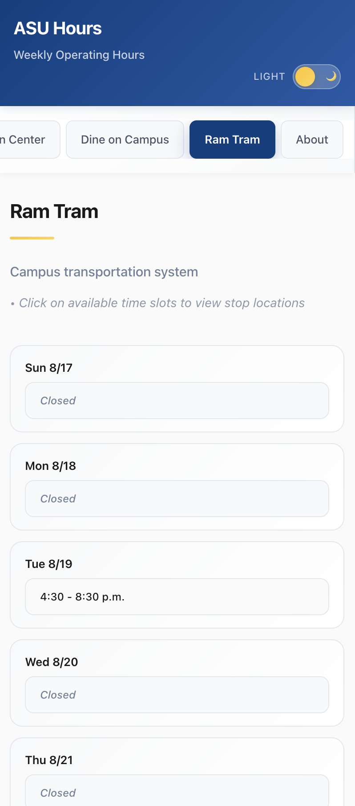

# ASU Facilities Hours of Operation

A web application providing real-time operating hours for ASU facilities including library, recreation center, dining locations, and campus transportation.

**Live Application**: [https://shinpark43.github.io/ASU-Facilities-Hours-of-Operation-Webpage/](https://shinpark43.github.io/ASU-Facilities-Hours-of-Operation-Webpage/)

## Mobile View

<div align="center">
  <table>
    <tr>
      <td align="center">
        
        <br/>
        <em>Porter Henderson Library</em>
      </td>
      <td align="center">
        
        <br/>
        <em>Recreation Center</em>
      </td>
    </tr>
    <tr>
      <td align="center">
        
        <br/>
        <em>Dining Locations</em>
      </td>
      <td align="center">
        
        <br/>
        <em>Ram Tram Transportation</em>
      </td>
    </tr>
  </table>
</div>

## Architecture

- **Frontend**: React with responsive design
- **Backend**: Node.js/Express with performance optimizations
- **Database**: SQLite with automated data collection
- **Hosting**: GitHub Pages with CI/CD automation

## Mobile App Installation

If you'd like to use it like a mobile app, here are the steps to add it to your home screen:

### For iOS:
1. **Navigate to the website**: Go to the web page you want to add
2. **Tap the Share button**: Locate and tap the Share button (square with an arrow) at the bottom of the screen
3. **Add to Home Screen**: Scroll down and tap "Add to Home Screen"

### For Android:
1. **Navigate to the website**: Go to the web page you want to add to your home screen
2. **Access the menu**: Tap the three dots (or three lines) in the top right corner of the browser
3. **Add to Home screen**: Select "Add to Home Screen" (or similar) from the menu

## Quick Start

### Prerequisites
- Node.js 18+
- npm

### Local Development
```bash
# Clone repository
git clone https://github.com/shinpark43/ASU-Facilities-Hours-of-Operation-Webpage.git
cd ASU-Facilities-Hours-of-Operation-Webpage

# Backend setup
cd backend
npm install
npm run init-db      # Initialize database
npm start           # Start server

# Frontend setup (in new terminal)
cd frontend
npm install
npm start           # Start development server
```

## Project Structure

```
├── frontend/                    # React application
│   ├── src/
│   │   ├── components/          # Layout components
│   │   ├── pages/              # Library, Recreation, Dining, Ram Tram, About
│   │   ├── services/           # API integration
│   │   └── styles/             # CSS styling
│   └── package.json
├── backend/                    # Node.js API server
│   ├── src/
│   │   ├── database.js         # Database operations
│   │   ├── scraper.js          # Data collection
│   │   └── routes/             # API endpoints
│   ├── scripts/                # Utility scripts
│   └── server.js              # Express server
└── README.md
```

## Features

### Frontend
- **ASU Branding**: Official blue & gold color scheme
- **Responsive Design**: Mobile-first approach
- **Tab Navigation**: Easy facility switching
- **Real-time Data**: Live facility hours
- **Four Main Sections**: Library, Recreation Center, Dining, Ram Tram

### Backend
- **Automated Data Collection**: Regular updates from official sources
- **API Caching**: Optimized response times
- **Error Handling**: Robust data processing
- **Health Monitoring**: System status tracking

## API Endpoints

```bash
GET /api/health                     # System health check
GET /api/facilities                 # All facilities metadata
GET /api/facilities/library         # Library hours
GET /api/facilities/recreation      # Recreation center hours
GET /api/facilities/dining          # Dining locations hours
```

## Responsive Design

- **Desktop**: Full sidebar navigation
- **Tablet**: Optimized layout
- **Mobile**: Dropdown navigation

## Technology Stack

### Frontend
- **React**: Modern functional components
- **CSS**: Custom properties and responsive design
- **API Integration**: Real-time data fetching

### Backend
- **Express.js**: RESTful API
- **SQLite**: Database storage
- **Automated Scraping**: Data collection system

## Testing

```bash
# Frontend tests
cd frontend
npm test

# Backend tests
cd backend
npm test
```

## License

This project is licensed under the MIT License - see the [LICENSE](LICENSE) file for details.

---

**Made for ASU students, faculty, and staff**